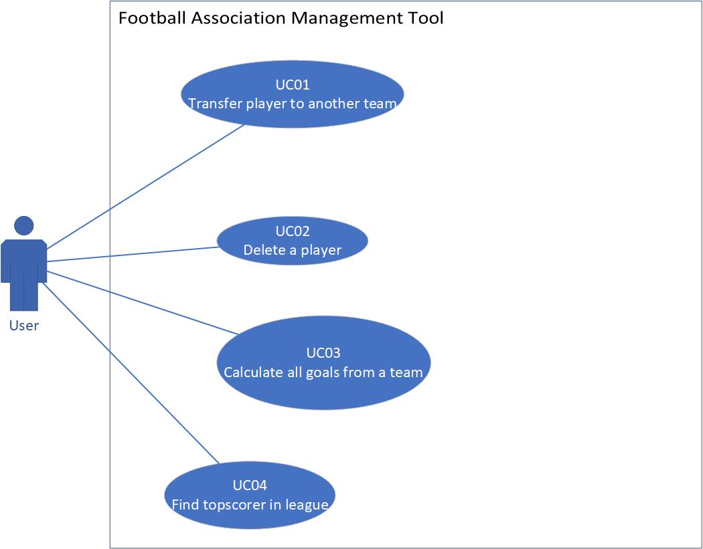
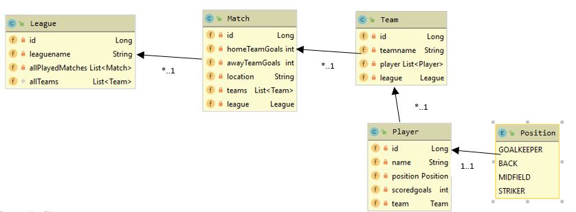
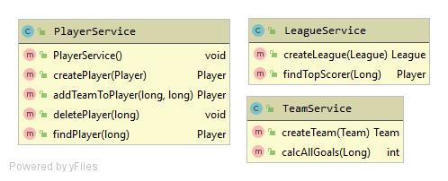
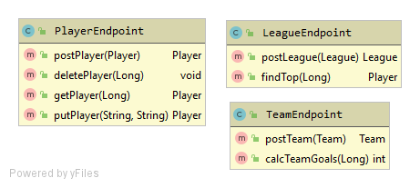

# Bonus Points Pascal Schaller FT2A

This is a documentation about the bonus project of the module Internet Technology.


#### Contents:
- [Analysis](#analysis)
  - [Scenario](#scenario)
  - [Use Case](#use-case)
- [Design](#design)
  - [Endpoint Prototype](#endpoint-prototype)
  - [Data Access / Persistence Layer](#data-access--persistence-layer)
  - [Business Layer](#business-layer)
  - [Service Layer / API](#service-layer--api)
- [Deployment](#deployment)

## Analysis

### Scenario

A little football association kept track of their leagues on an Excel Sheet. This led to inconsistency in the data. Neither was it possible to communicate to different football associations digitally, which is a requirement for participating in bigger tournaments. A solution is wished, where the different services can be accessed via different interfaces and which is accessible and consistent all the time.

### Use Case


Note: Simple create Use Cases are omitted.

- UC01 [Transfer player to another team]: A player can be added to a team in case of debut or transfer. 
- UC02 [Delete a player]: When a player retires or has a serious injury the user can delete him from the association.
- UC03 [Calculate all goals from a team]: To determine the league winner, the user can calculate all the goals which the team scored.
- UC04 [Find topscorer in league]: The user can find the topscorer in a league.

## Design

### Endpoint Prototype

Note: This serves as a reference/prototype. All other endpoints are omitted and can be accessed using swagger.

**Path**: [`/api/player`](/api/customer) 

**Method:** `POST`

**Sample Request**  • *Header:* `Content-Type: application/json` • *Body:*

```JSON
{
  "id": 0,
  "name": "string",
  "position": "GOALKEEPER",
  "scoredgoals": 0,
  "team": {
    "id": 0,
    "league": {
      "allPlayedMatches": [
        {}
      ],
      "allTeams": [
        null
      ],
      "id": 0,
      "leaguename": "string"
    },
    "teamname": "string"
  }
}
  
**Success Response**  • *Code:* `200 OK` • *Sample Body:*

```JSON
{
  "id": 0,
  "name": "string",
  "position": "GOALKEEPER",
  "scoredgoals": 0,
  "team": {
    "id": 0,
    "league": {
      "allPlayedMatches": [
        {}
      ],
      "allTeams": [
        null
      ],
      "id": 0,
      "leaguename": "string"
    },
    "teamname": "string"
  }
}
```

**Error Response** • *Code:* `404 NOT FOUND`

### Data Access / Persistence Layer

The `rocks.process.acrm.data.domain` package contains the following domain objects / entities including getters and setters:




### Business Layer

The `rocks.process.acrm.business.service` package contains classes of the following business services:




### Service Layer / API

On the service layer, the API for customer management has been realised using the REST style as depicted in the following:



Further can be seen using the Swagger-UI.

## Deployment

This spring boot application can be deployed to Heroku by adding the following `Procfile` to the project root:
```console
web: java -Dserver.port=$PORT $JAVA_OPTS -jar /target/*.jar
```

Finally the Swagger-UI can be access using the Heroku app specific address such as: `https://***.herokuapp.com/swagger-ui.html`
